## Installing NodeJS 

1. **Download the Node.js LTS ZIP Distribution**:
   - Go to the [official Node.js website](https://nodejs.org/).
   - Navigate to the "Downloads" and then use option "Prebuilt Binaries"
   - Choose the "Windows" option.
   - Scroll down to the "LTS" section and click on the "ZIP" link to download the ZIP distribution.

    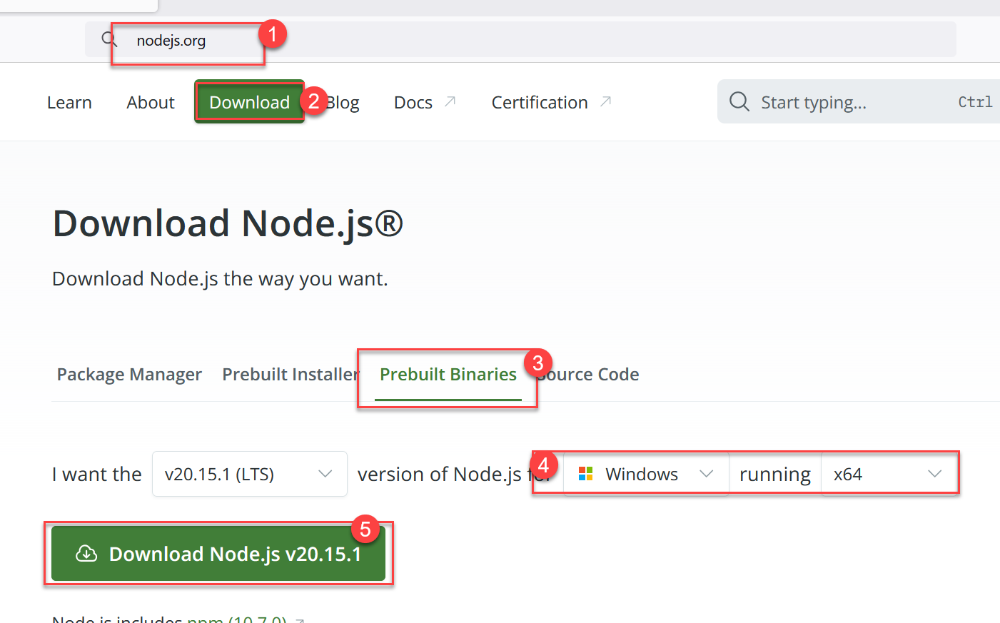
    

1. **Extract the ZIP File**:
   - Once the download is complete, locate the ZIP file in your "Downloads" folder or wherever you saved it.
   - Right-click the ZIP file and select "Extract All...".
   - Set the extraction path to `C:\node-home`.

    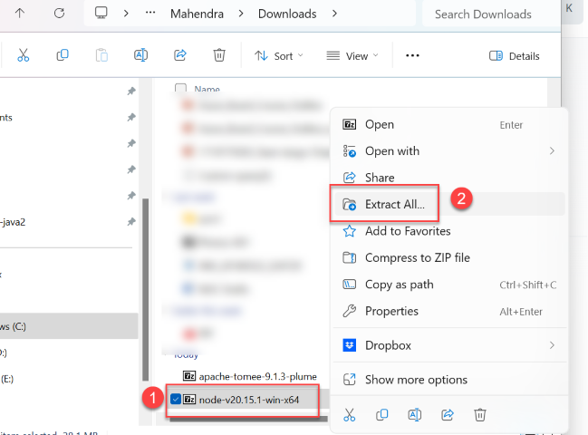
    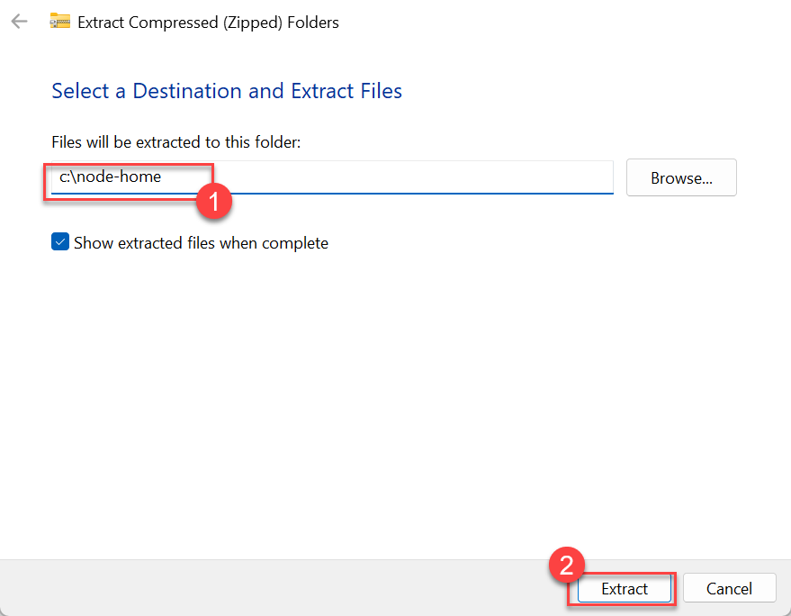

1. The default extraction using Windows built in extraction tool would result in creation of nested folder, you must move all the files to c:\node-home

   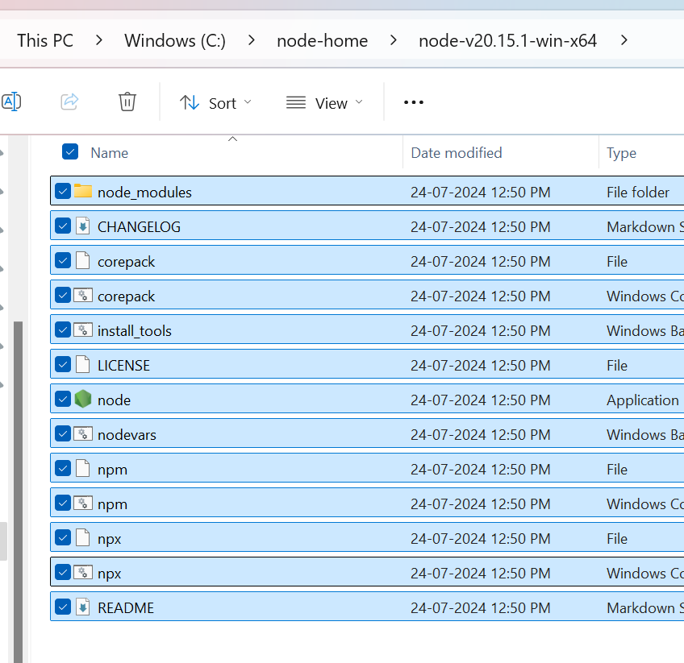

   It should instead look like this :

   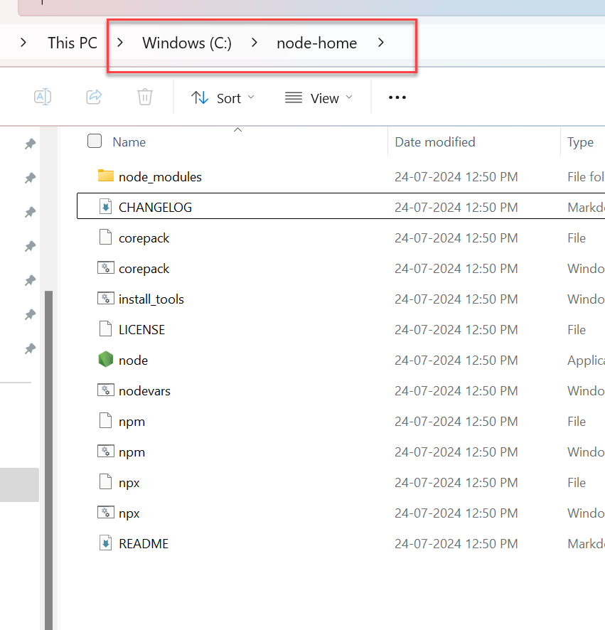

1. **Set Environment Variables**:
   - Open the Start menu and search for "Environment Variables".
   - Select "Edit the system environment variables".
   - In the System Properties window, click on the "Environment Variables..." button.

    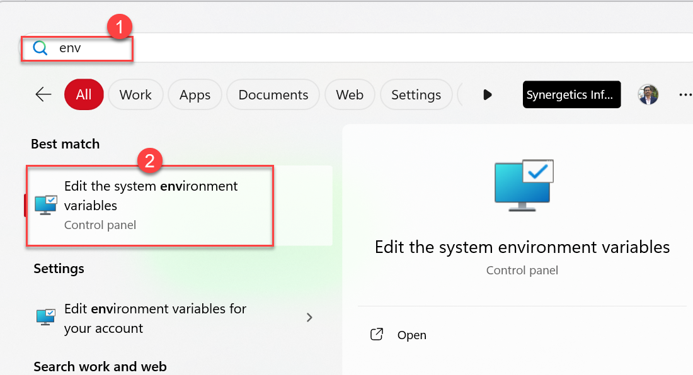
    
1. **Set NODE_HOME Variable**:
   - In the Environment Variables window, click "New..." under the "System variables" section.
   - Set the "Variable name" to `NODE_HOME`.
   - Set the "Variable value" to `C:\node-home`.
   - Click "OK".

   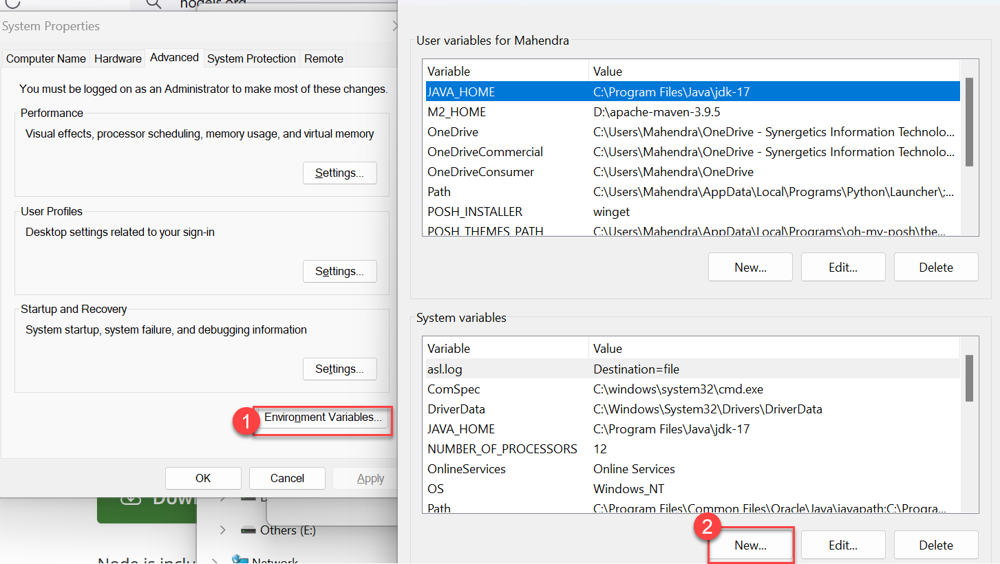
   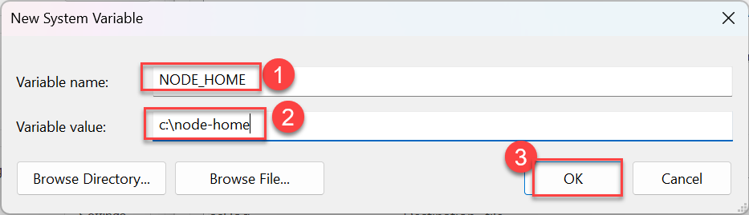

1. **Add Node.js to System PATH**:
   - In the Environment Variables window, find the "System variables" section and scroll down to find the "Path" variable.
   - Select the "Path" variable and click "Edit...".
   - Click "New" and add the path `C:\node-home`.

   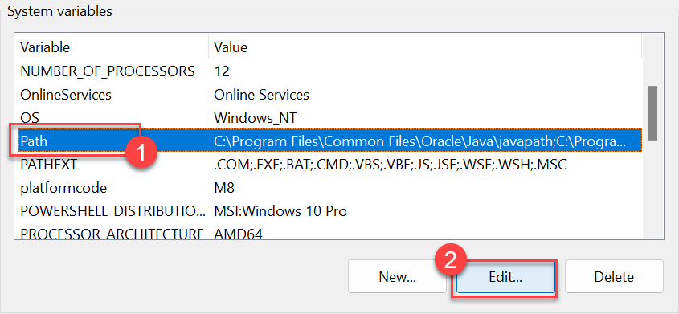
   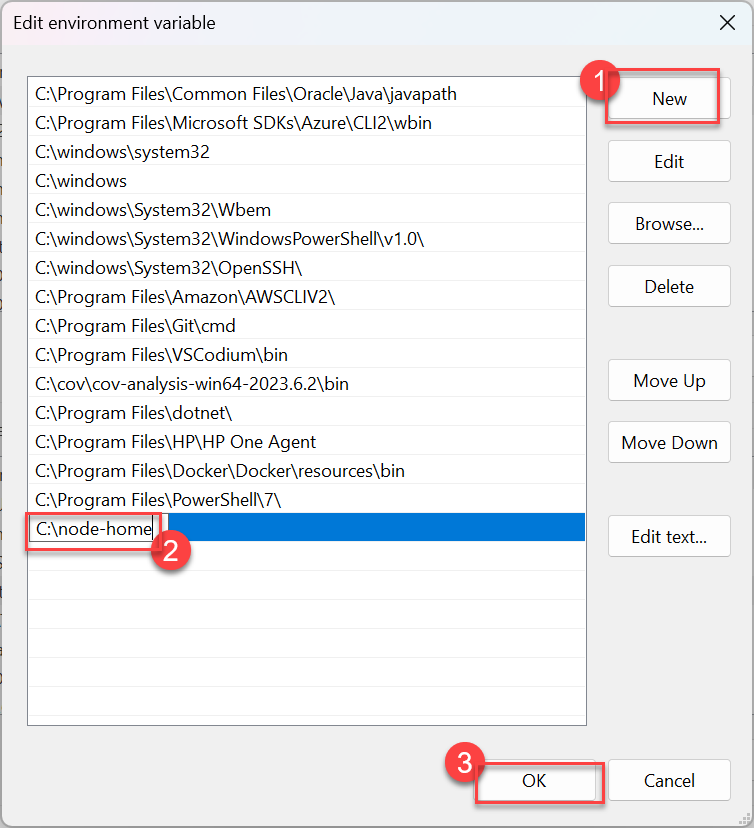

    > Update to System Variables need restarting all CMD or Powershell terminals

1. **Verify the Installation**:
   - Open Command Prompt.
   - Type `node -v` and press Enter to check the installed Node.js version.
   - Type `npm -v` and press Enter to check the installed npm version.

   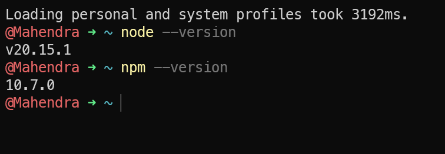

If both commands return the expected version numbers, Node.js and npm have been successfully installed and configured.
