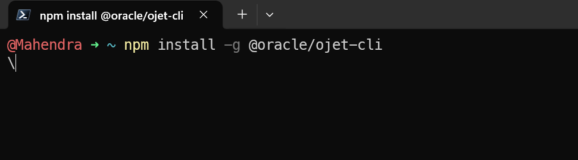
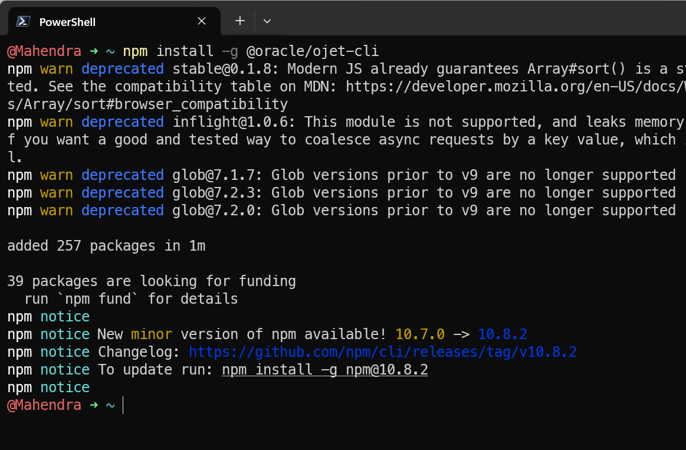

## Install Oracle JET (ojet) Using npm

1. **Install Node.js**:
   Ensure you have Node.js installed on your system. If not, follow the steps to download and install it as in [here](./01-node.md)

2. **Open Command Prompt**:
   Open the Command Prompt or PowerShell on your Windows machine.

3. **Install Oracle JET CLI**:
   Run the following command to install the Oracle JET command-line interface globally using npm:

   ```sh
   npm install -g @oracle/ojet-cli
   ```

   
   

4. **Verify the Installation**:
   After the installation is complete, verify that the Oracle JET CLI has been installed correctly by checking the version:
   ```sh
   ojet -v
   ```
   This command should display the installed version of the Oracle JET CLI.
